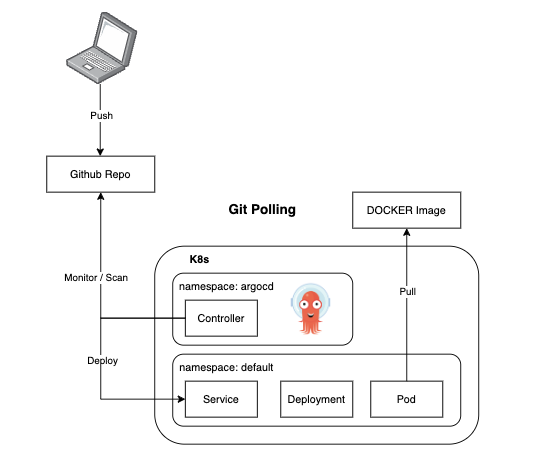
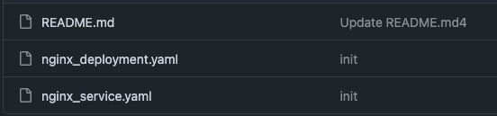
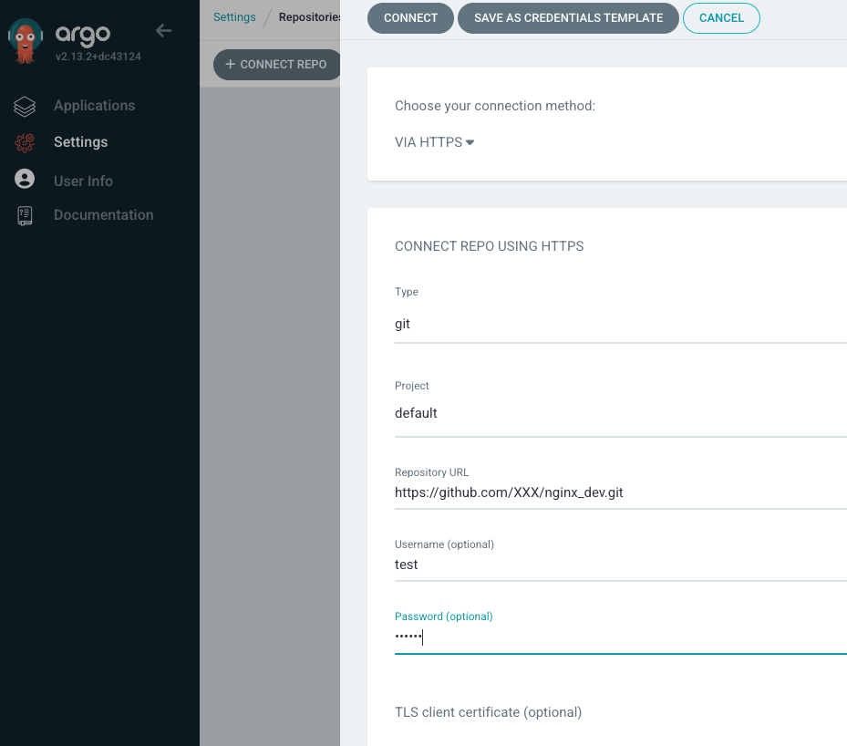
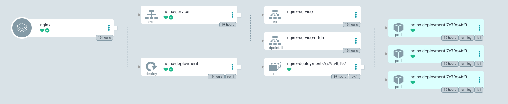

# GitOps: ArgoCD 101

## What is GitOps ?

- **Infrastructure as Code (IaC)**
   The state of Kubernetes resources are defined in files (e.g., Yaml/Helm Charts)
- **Version control** \
 All files (e.g., Yaml/Helm Charts) are stored in Git for version control.
- **Automated infrastructure updates through automated pipelines** \
 A corresponding controller is installed within the Kubernetes environment to monitor updates in the Git repository and synchronize all changes to the Kubernetes cluster.
- **Enhance Security** \
 The KUBECONFIG file is not shared, so no one can directly access the Kubernetes cluster.

## The deployment workflow using ArgoCD



## Setup Steps

1. Set context to Docker Desktop

 ``` bash
 kubectl config use-context docker-desktop
 ```

2. Install Argo CD

 ``` bash
 # create a new namespace and install the argocd staffs.
 kubectl create namespace argocd
 kubectl apply -n argocd -f https://raw.githubusercontent.com/argoproj/argo-cd/stable/manifests/install.yaml
 ```

3. Install Argo CD Cli

 ``` bash
 brew install argocd
 kubectl port-forward svc/argocd-server -n argocd 8080:443
 ```

4. Get Username and Password

 ``` bash
 argocd admin initial-password -n argocd
 argocd login 127.0.0.1:8080
 argocd account update-password
 ```

5. Setup Repository
   - Create repo `https://github.com/XXX/nginx_dev.git`.
  

   - Generate access token

  ```text
  Settings -> Developer settings -> Personal access tokens
  ```

  Ref: [Github managing-your-personal-access-tokens](https://docs.github.com/en/authentication/keeping-your-account-and-data-secure/managing-your-personal-access-tokens)

6. Setup Argo Connection

- For Repo connection (`Settings -> CONNECT REPO`)
  

- Create an new application
  - **Sync Policy**: `Automatic` \
   The default polling interval for Git repository changes is **3 minutes**. You can configure this in the argocd-repo-server component by setting the `ARGOCD_RECONCILIATION_TIMEOUT` environment variable.

   To change it, update the argocd-repo-server deployment:

   ```bash
   kubectl edit deployment -n argocd argocd-repo-server
   ```

   Add or modify the ARGOCD_RECONCILIATION_TIMEOUT environment variable:

   ```yaml
   env:
   - name: ARGOCD_RECONCILIATION_TIMEOUT
   value: "60" # Interval in seconds (e.g., 60 seconds = 1 minute)
   Then save and apply the changes.
   ```

  - **Source** \
   Repository URL: `https://github.com/XXX/nginx_dev.git` \
   Revision: `HEAD` \
   Path: `.`

  - **Destination** \
     Cluster URL: <https://kubernetes.default.svc> \
   Namespace: default

7. Successfully connect \
 
